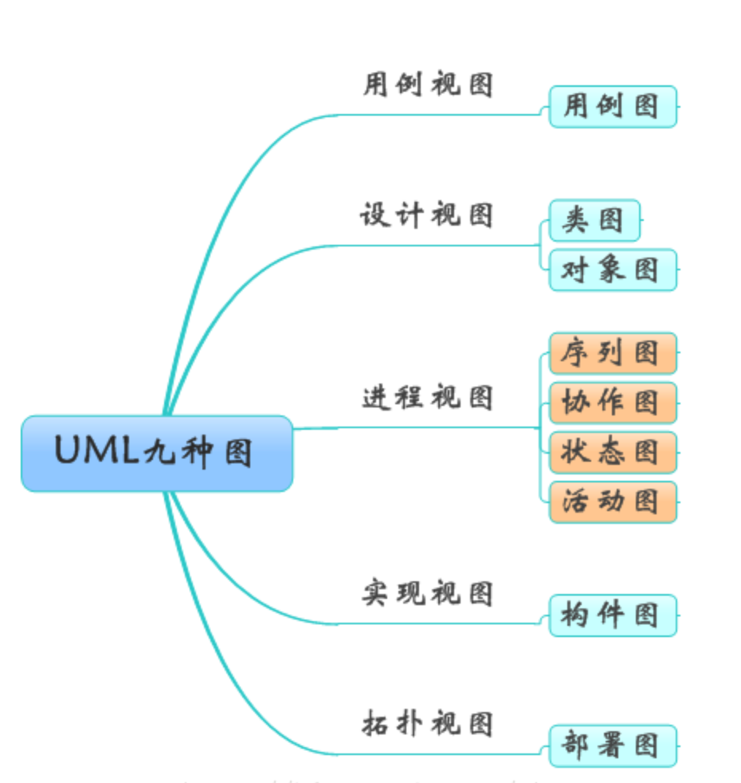
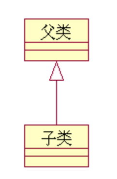
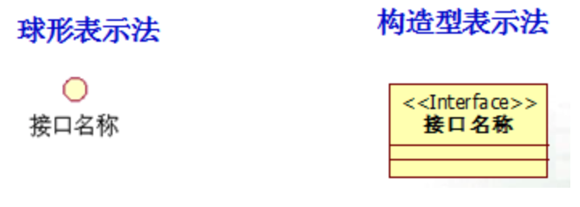
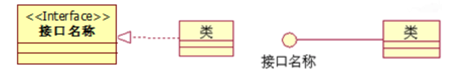
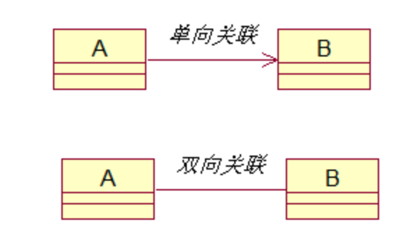
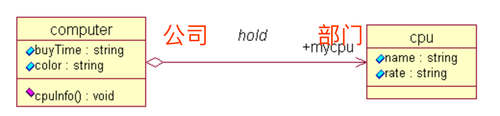
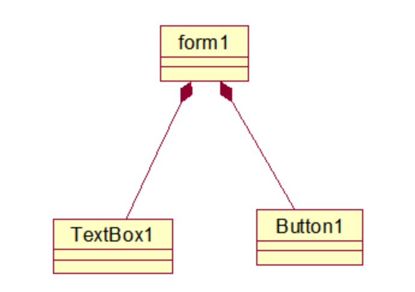
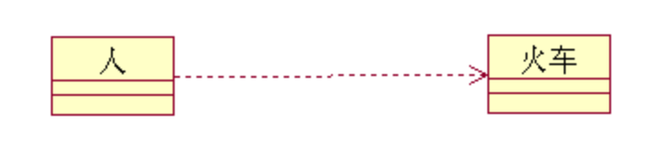
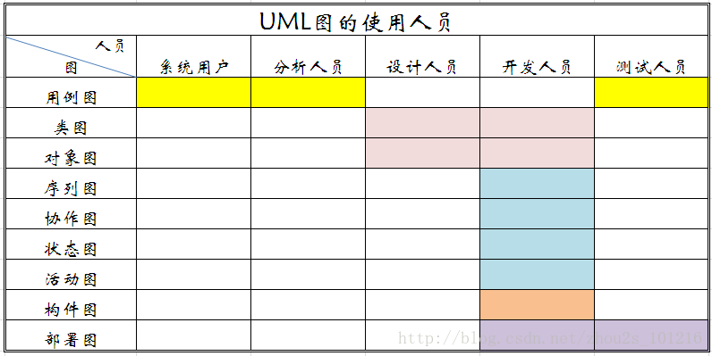

# UML 图

> UML-Unified Modeling Language, [统一建模语言](https://baike.baidu.com/item/%E7%BB%9F%E4%B8%80%E5%BB%BA%E6%A8%A1%E8%AF%AD%E8%A8%80/3160571)， 又称标准建模语言。是用来对软件密集系统进行可视化建模的一种语言。UML的定义包括UML语义和UML表示法两个元素。

## 一、基本概念

### 1. 用例图（UseCase Diagrams）：

&#160; &#160; &#160;用例图主要回答了两个问题：1、是谁用软件。2、软件的功能。从用户的角度描述了系统的功能，并指出各个功能的执行者，强调用户的使用者，系统为执行者完成哪些功能。

### 2. 类图（Class Diagrams）：
  
&#160; &#160; &#160;用户根据用例图抽象成类，描述类的内部结构和类与类之间的关系，是一种静态结构图。 在UML类图中，常见的有以下几种关系: 泛化（Generalization）,  实现（Realization），关联（Association)，聚合（Aggregation），组合(Composition)，依赖(Dependency)。

&#160; &#160; &#160;**各种关系的强弱顺序： 泛化 = 实现 > 组合 > 聚合 > 关联 > 依赖**

> 1. 【泛化关系】：

**是一种继承关系，它指定了子类如何继承父类的所有特征与行为。 生活中，就会出现一类事物具有另一类事物的全部特点，除此之外还有自身的特点。 例如：黑白电视机，彩色电视机，都是电视机，他大舅他二舅都是他舅...**

- 泛化关系的概念与符号（Generalization）

**如果一个类A(父类)的属性和操作能被另一个类B(子类)所继承，则类B不仅可以包含类A中的属性和操作，而且还可以添加自己独有的属性和操作，这种机制就是泛化。泛化也称之为继承或派生。**

- 泛化关系的应用——多态 
  - 多态性：在泛化关系中，父类所定义的操作被子类继承之后，可以表现出不同的行为。
  - 多态性允许在（有继承关系的）多个类中定义同名的操作，并在每一个类中有不同的实现。

- 多态的实现机制
  - 子类覆盖父类同名的方法。
    当一个类被继承时，他的方法也就被其子类继承。这种继承可以是无条件的继承全部旧方法，也可以重新编写新方法来覆盖旧方法。

  - 多态就是指不同对象收到相同消息时，会产生不同行为，同一个类在不同的场合下表现出不同的行为特征.

  - 多态的作用：把不同的子类对象都当作父类来看，可以屏蔽不同子类对象之间的差异，写出通用的代码，做出通用的编程，以适应需求的不断变化。

> 2. 【实现关系】：

**接口是一组没有实现的操作的集合。接口只提供操作的声明，不提供任何相应的功能代码。具体的功能代码由使用该接口的类实现， 是一种类与接口的关系，表示类是接口所有特征和行为的实现。这叫做实现关系**

> 3. 【关联关系】：

**关联用来表示两个或多个类的对象之间的结构关系，它在代码中表现为一个类以属性的形式包含对另一个类的一个或多个对象的应用。 是一种拥有的关系，它使一个类知道另一个类的属性和方法；如：老师与学生，丈夫与妻子关联可以是双向的，也可以是单向的。双向的关联可以有两个箭头或者没有箭头，单向的关联有一个箭头**

> 4. 【聚合关系】

**是整体与部分的关系，聚合意味着一个类拥有但共享另一个类的对象。`且部分可以离开整体而单独存在`。如车和轮胎是整体和部分的关系，轮胎离开车仍然可以存在。`聚合关系是关联关系的一种，是强的关联关系`；关联和聚合在语法上无法区分，必须考察具体的逻辑关系。**

- 聚合的符号，在整体类端加空心菱形。

> 5. 【组合关系（合成、组成）】

**`是整体与部分的关系，但部分不能离开整体而单独存在`。如公司和部门是整体和部分的关系，没有公司就不存在部门。**

**`组合关系是关联关系的一种，是比聚合关系还要强的关系`，它要求普通的聚合关系中代表整体的对象负责代表部分的对象的生命周期。**

- 与聚合相比，它有两个特点：
  - `一个部分类最多只能属于一个整体类`
  - `当整体类不存在时，部分类将同时被销毁。`

-  组成的符号：在整体类端加实心菱形。带实心菱形的实线，菱形指向整体.如图：

> 6. 【依赖关系】

**是一种使用的关系，当两个类处于依赖关系中时，其中一个类的改变可能会影响另一个类，即一个类的实现需要另一个类的协助，所以要尽量不使用双向的互相依赖.**

- 依赖关系的概念与符号， 带箭头的虚线，指向被使用者

- 代码体现： 依赖关系意味着一个类的对象出现在另一个类的操作中。常见的有两种情况：一个类将另一个类的对象作为自己某个操作的参数（形参），或者是操作的局部变量。 局部变量、方法的参数或者对静态方法的调用

### 3. 对象图（Object Diagrams）:

&#160; &#160; &#160;对象图是类图的一个实例，描述了系统在具体时间点上包含的对象以及各个对象之间的关系。可以看作各个对象在交互过程中某一时刻的状态描述的是交互的静态部分。

### 4. 状态图（Statechart Diagrams）：

&#160; &#160; &#160;是一种由状态、变迁、事件和活动组成的状态机，用来描述类的对象所有可能的状态以及时间发生时状态的转移条件。

- 状态图重点在于描述对象的状态及其状态之间的转移，状态图的基本元素主要有：状态、转移、动作、自身转移、组合状态、进入节点、退出节点、历史状态、并发区域等，状态中的事件分为调用事件（Ca ll ）、变化事件（Change）、时间事件（Time）和信号事件(Singal)。最后以实例对状态对进行了分析。

[UML建模之状态图（Statechart Diagram）](https://blog.csdn.net/w36680130/article/details/81014032)

### 5、活动图（Activity Diagrams）:

&#160; &#160; &#160;是状态图的一种特殊情况，这些状态大都处于活动状态。本质是一种流程图，它描述了活动到活动的控制流。

交互图强调的是对象到对象的控制流，而活动图则强调的是从活动到活动的控制流。

活动图是一种表述过程基理、业务过程以及工作流的技术。

它可以用来对业务过程、工作流建模，也可以对用例实现甚至是程序实现来建模。

[UML建模之活动图与状态图](https://www.cnblogs.com/jingwhale/p/4230235.html)
[活动图](https://www.cnblogs.com/wolf-sun/p/3432135.html)

### 6、序列图（Sequence Diagrams）：

&#160; &#160; &#160;交互图的一种，描述了对象之间消息发送的先后顺序，强调时间顺序。序列图的主要用途是把用例表达的需求，转化为进一步、更加正式层次的精细表达。用例常常被细化为一个或者更多的序列图。同时序列图更有效地描述如何分配各个类的职责以及各类具有相应职责的原因。

[UML建模之时序图](https://www.cnblogs.com/wolf-sun/p/UML-Sequence-diagram.html)

### 7、协作图（Collaboration Diagrams）：

&#160; &#160; &#160;交互图的一种，描述了收发消息的对象的组织关系，强调对象之间的合作关系。时序图按照时间顺序布图，而写作图按照空间结构布图。

[协作图](https://blog.csdn.net/mrbaymax/article/details/81286321)
[用例图、活动图、时序图之间的关系？](https://www.cnblogs.com/wolf-sun/p/UML-collaboration-diagram.html)

### 8、构件图（Component Diagrams）：

&#160; &#160; &#160;描述了一组代码构件的物理结构之间的组织和依赖关系。用来表示系统中构件与构件之间，类或接口与构件之间的关系图。其中，构建图之间的关系表现为依赖关系，定义的类或接口与类之间的关系表现为依赖关系或实现关系。

### 9、部署图（Deployment Diagrams）:

&#160; &#160; &#160;描述了系统运行时进行处理的结点以及在结点上活动的构件的配置。强调了物理设备以及之间的连接关系。

- 部署模型的目的：

描述一个具体应用的主要部署结构，通过对各种硬件，在硬件中的软件以及各种连接协议的显示，可以很好的描述系统是如何部署的；平衡系统运行时的计算资源分布；可以通过连接描述组织的硬件网络结构或者是嵌入式系统等具有多种硬件和软件相关的系统运行模型。

[部署图？？](https://blog.csdn.net/whc888666/article/details/82944450)

## 二、图的差异比较
### 1. 序列图(时序图)VS协作图

&#160; &#160; &#160;序列图和协作图都是交互图。二者在语义上等价，可以相互转化。但是侧重点不同：序列图侧重时间顺序，协作图侧重对象间的关系。

- 共同点:
  - `时序图与协作图均显示了对象间的交互。`

- 不同点：
  - `时序图强调交互的时间次序。`
  - `协作图强调交互的空间结构。`

### 2. 状态图VS活动图

&#160; &#160; &#160;状态图和活动图都是行为图。状态图侧重从行为的结果来描述，活动图侧重从行为的动作来描述。状态图描述了一个具体对象的可能状态以及他们之间的转换。在实际的项目中，活动图并不是必须的，需要满足以下条件：
  - 1、出现并行过程&行为
  - 2、描述算法
  - 3、跨越多个用例的活动图。

### 3. 活动图VS交互图

&#160; &#160; &#160;二者都涉及到对象和他们之间传递的关系。区别在于交互图观察的是传送消息的对象，而活动图观察的是对象之间传递的消息。看似语义相同，但是他们是从不同的角度来观察整个系统的。

## 三、UML图与软件工程uml

&#160; &#160; &#160;了解了UML图，我把它和之前学过的软件工程进行了结合，UML图是软件工程的组成部分，软件工程从宏观的角度保证了软件开发的各个过程的质量。而UML作为一种建模语言，更加有效的实现了软件工程的要求。

- 如下图，在软件的各个开发阶段需要的UML图。

- 下表是UML使用人员图示：

