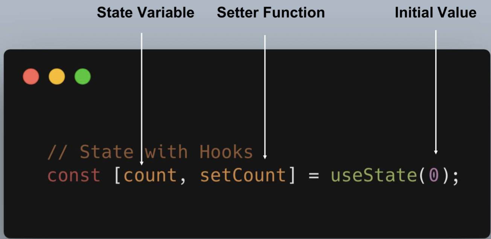

# React - Hocks

- New React API
- Function components
- The future of React

``` php
    Components Has State ?
  yes                     No
   |                       |
   |                       |
  Class Component         FUnction Component
  DidMount                  (Stateless)
  WillUnMount
```

## Why use Hocks ?

- Binding
- No Breaking Changes
- Stateful logic(跨组件复用含状态)


## Old Components
### Original Component API

``` js
import React from 'react';

const Greeter = React.createClass({
  render: function() {
    return <div> Hello {this.props.fisterName} </div>
  }
})

export default Greeter
```


### Class Components API

``` js
import React, { Component } from 'react';

class Greeter extends Component {
  render() {
    return <div>Hello {this.props.firstName}</div>
  }
}

export default Greeter
```


### State & Lifecycle

``` js
import React, { Component } from 'react';

class Greeter extends Component {
  state = {
    loading: false
  }

  componentDidMount() {
    this.setState({ loading: true })
  }

  render() {
    return <div>Hello {this.props.firstName}</div>
  }
}

export default Greeter
```

### Pure Function COmponent

``` js
export const Greeter = props => {
  return <div>Hello {props.fristName}</div>
}
```

## Hocks API

- Basic
  - useState
  - useEffect
  - useComtext
- Additional Hooks
  - useReducer
  - useCallback
  - useMemo
  - useRef
  - useImperativeHandle
  - useLayoutEffect
  - useDebugValue


- UseState Defined



- UseState Vs Array

``` js
// Without Destructuring
const countStateArray = useState(0)

const count = countStateArray[0]
const setCount = countStateArray[1]
```

### UseState Example Old Style

``` js
import React, { Component } from 'react'

class OldDemo1 extends Component {
  constructor(props) {
    super(props)
    this.state = {
      count: 0
    }
  }

  render() {
    const { count } = this.state
    return (
      <div>
        <p>You clicked { count } times</p>
        <button onClick={() => this.setState({ count: count + 1 })}>
          Click me
        </button>
      </div>
    )
  }
}

export default OldDemo1

```

### UseState Example Hock Style

``` js
function UseStateDemo() {
  const [count, setCount] = useState(0)

  return (
    <div>
      MyCount: { count }
      <br />
      <button onClick={() => setCount(0)}> Reset </button>
      <button onClick={() => setCount(count + 1)}> + </button>
      <button onClick={() => setCount(count - 1)}> - </button>
    </div>
  )
}
export default UseStateDemo
```

### Render Props Vs Hooks

``` js
// This is Function and Class Components, ButtonControl contains all the state-related stuff
class ButtonControl extends Component {
  constructor(props) {
    super(props)
    this.state = {
      isDisplay: false
    }
  }

  hide = () => this.setState({ isDisplay: false });
  show = () => this.setState({ isDisplay: true });

  render() {
    return this.props.children({
      ...this.state,
      hide: this.hide,
      show: this.show
    })
  }
}

// MessageButton is only a function component, 
const MessageButton = () => {
  return (
    <ButtonControl>
      {({ isDisplay, hide, show }) => (
        <div>
          { isDisplay && <p onClick={ hide }>Click to hide</p> }
          <button onClick={show}>Click to show</button>
        </div>
      )}
    </ButtonControl>
  )
}

// or Hoc
const Zoo = WrappedComponent => {
  constructor(props) {
    super(props)
    this.state = {
      cat: 'British Shorthair Cat'
    }
  }
  render() {
    return <WrappedComponent cat={this.state.cat} {...props} />
  }
}

// This is a React Hocks
const MessageHockButton = () => {
  const [isDisplayed, show] = useState(false)

  return (
    <div>
      { isDisplayed && <p onClick={() => show(false)}> Click me to hide </p> }
      <button onClick={() => show(true)}> Click me to show </button>
    </div>
  )
}
```
::: danger
**Be careful !**  

Don't call Hocks inside loops, conditions, or nestedfunctions - Only call Hocks **at the top level !**

Don't call Hocks from regular JavaScript functions - Only call Hocks **from React function components**
:::


``` js
**This is Example**

const ExampleMaynState = () => {
  const [age, setAge] = useState(18)
  const [fruit, setFruit] = useState('apple')
  const [todos, setToods] = useStaet([{ text: 'Learn Hocks' }])
}
```

useState 没有规定一定要是number， string 的几本数据类型，也可以是object or array，需要注意： 之前我们用的state是将所有的状态合并后返回一个新状态，而 useState是直接替换老状态后返回新状态。 最后，react也给我们提供了一个useReducer的hook，如果你更喜欢redux式的状态管理方案的话

**So, useState无论调用多少次，相互之间是独立的。这一点至关重要。**

其实我们看hook的“形态”，有点类似之前被官方否定掉的Mixins这种方案，都是提供一种“插拔式的功能注入”的能力。而mixins之所以被否定，是因为Mixins机制是让多个Mixins共享一个对象的数据空间，这样就很难确保不同Mixins依赖的状态不发生冲突。

而现在我们的hook，一方面它是直接用在function当中，而不是class；另一方面每一个hook都是相互独立的，不同组件调用同一个hook也能保证各自状态的独立性。这就是两者的本质区别了。

> react是怎么保证多个useState的相互独立的？

还是看上面给出的ExampleMaynState例子，我们调用了三次useState，每次我们传的参数只是一个值（如42，‘banana’），我们根本没有告诉react这些值对应的key是哪个，那react是怎么保证这三个useState找到它对应的state呢？

答案是，react是根据useState出现的顺序来定的。我们具体来看一下：
``` js
// 第一次渲染
[age, setAge] = useState(18)  // 将 age 初始化为18
[fruit, setFruit] = useState('apple')  // 将 fruit 初始化为apple
[todos, setToods] = useStaet([{ text: 'Learn Hocks' }]) // ...

// 第二次渲染
[age, setAge] = useState(18)  // 读取变量age的值（这时候传的42会直接被忽略）
[fruit, setFruit] = useState('apple')  // 读取变量fruit（这时候传的fruit也会被忽略）
[todos, setToods] = useStaet([{ text: 'Learn Hocks' }])  // ...
```
如果我们改一下代码：
``` js
let showFruit = true
const ExampleMaynState = () => {
  const [age, setAge] = useState(18)

  if (showFruit) {
    const [fruit, setFruit] = useState('apple')
    showFruit = false
  }

  const [todos, setToods] = useStaet([{ text: 'Learn Hocks' }])
}
```
这样一来，
``` js
// 第一次渲染
[age, setAge] = useState(18)  // 将 age 初始化为18
[fruit, setFruit] = useState('apple')  // 将 fruit 初始化为apple
[todos, setToods] = useStaet([{ text: 'Learn Hocks' }]) // ...

// 第二次渲染
[age, setAge] = useState(18)  // 读取变量age的值（这时候传的42会直接被忽略）
// [fruit, setFruit] = useState('apple')
[todos, setToods] = useStaet([{ text: 'Learn Hocks' }])  // 读取的是fruit的值，导致报错
```
**鉴于此，react规定我们必须把hooks写在函数的最外层，不能写在ifelse等条件语句当中，来确保hooks的执行顺序一致**

## UseEffect()

### useEffect(fn, []) (life - cycles) 

``` js
useEffect(() => {
  // ComponentDidMount and ComponentDidUpdate 周期的函数体
  return () => {
    // ComponentWillUnmount 周期的函数体
  }
});

------------>>

useEffect(() => {
  // 仅在ComponentDidMount 的时候执行
}, []);

------------>>

useEffect(() => {
  // 仅在ComponentDidMount 的时候执行
  // 只有 stateName \ props.id的值发生改变
}, [stateName, props.id])

```

> **实现生命周期** (life - cycles) 

``` js
class OldLifeExample extends Component {
  componentDidMount() {
    console.log('I am a old mounted !')
  }

  componentDidUpdate() {
    console.log('old mounted or update')
  }

  componentWillMount() {
    console.log('old will unmount')
  }

  render() {
    return "I'm a life cycle demo"
  }
}

const NewLifecycle = () => {
  useEffect(() => {
    console.log('render')
    return () => { console.log('unmounting...') };
  })

  return "I'm a lifecycle demo"
}
```

### UseEffect Performance
``` js
const Greeting1 = ({ name }) => {
  useEffect(() => {
    console.log('Hello1, ' + name)
  })
  return <h1 className="Greeting">Hello, { name }</h1>
}


const Greeting2 = ({ name }) => {
  const [counter, setCounter] = useState(0)

  useEffect(() => {
    console.log('Hello2, ', + name)
  })

  return (
    <h1 className="Greeting">
      Hello, { name }
      <button onClick={() => setCounter(counter + 1)}>Increment</button>
    </h1>
  )
}
```
### UseEffect Emample

- **只想在挂载的时候运行它**

``` js
const SearchResults = () => {
  const [count, setCount] = useState(0)
  async function fetchData() {
    console.log('call api fetch data')
  }

  useEffect(() => {
    fetchData()  // Is this okay? No alwaya -- and there's a better way to write it
  });

  return (
    <div>
      <h1>get Data</h1>
      <p>You click { count } times</p>
      <button onClick={() => setCount(count + 1)}>Click me</button>
    </div>
  )
}
```
